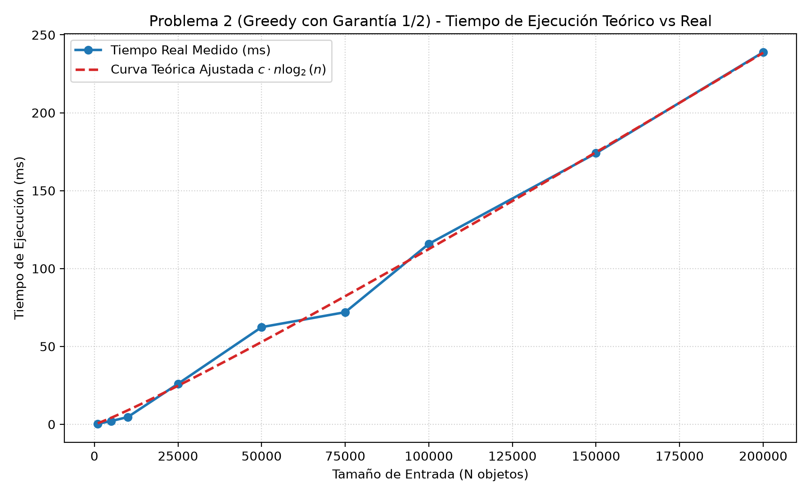
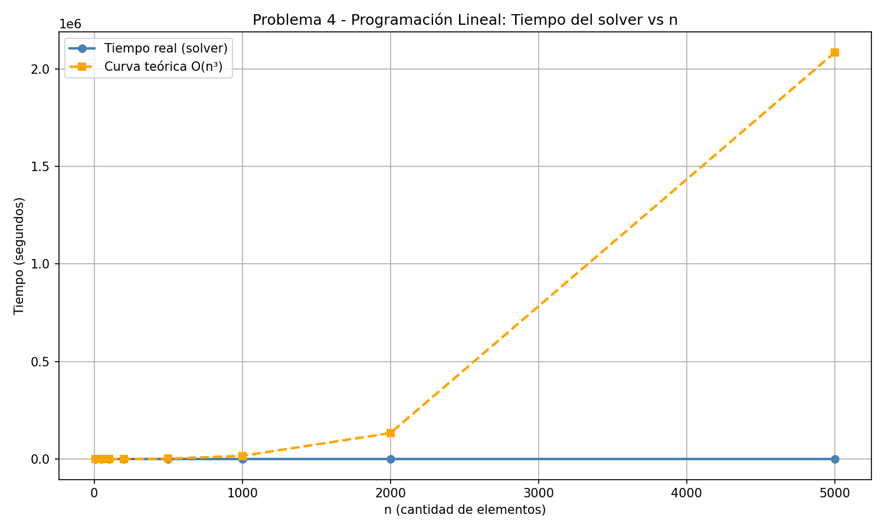

<div align="center">


# UNIVERSIDAD DE BUENOS AIRES
### FACULTAD DE INGENIERÍA
**Departamento de Computación**  
**Materia:** Teoría de Algoritmos (Código: TB024 / 75.29 / 95.06)  
**Cátedra:** Lic. Pablo Echevarría  
**Cuatrimestre:** 2° Cuatrimestre de 2026  

---

# TRABAJO PRÁCTICO 1
## El Problema de la Mochila

---

### Integrantes del Grupo

| # | Apellido y Nombre | Padrón |
| :-: | :--- | :-: |
| **1** | **Avila Solano, Nelson Brian** | **100244** |
| **2** | *[Apellido y Nombre]* | *[Padrón]* |
| **3** | *[Apellido y Nombre]* | *[Padrón]* |
| **4** | *[Apellido y Nombre]* | *[Padrón]* |

**Fecha de Entrega:** Septiembre de 2026  

</div>

<div style="page-break-after: always;"></div>

---

## Índice General

1. [Introducción al Problema de la Mochila](#1-introducción-al-problema-de-la-mochila)
2. [Fuerza Bruta vs. Backtracking](#2-fuerza-bruta-vs-backtracking)
   - 2.1 Fuerza Bruta *(Pendiente)*
   - 2.2 Backtracking *(Pendiente)*
   - 2.3 Comparativa FB vs. BT *(Pendiente)*
3. [Algoritmo Greedy](#3-algoritmo-greedy)
   - 3.1 Supuestos
   - 3.2 Diseño
     - 3.2.1 Estructuras de Datos Utilizadas
     - 3.2.2 Pseudocódigo
     - 3.2.3 Garantía de Calidad (1/2) y Demostración Matemática
   - 3.3 Seguimiento con Set Reducido (Activación de la Garantía de Calidad)
   - 3.4 Complejidad Temporal
   - 3.5 Sets de Datos
   - 3.6 Tiempos de Ejecución
   - 3.7 Informe de Resultados
4. [Programación Dinámica](#4-programación-dinámica)
   - 4.1 Planteo Tradicional: Maximizar Beneficio para Capacidad Fija *(Pendiente)*
   - 4.2 Planteo Alternativo: Minimizar Peso para Beneficio Fijo *(Pendiente)*
   - 4.3 Comparación entre ambos Planteos de PD *(Pendiente)*
5. [Programación Lineal Entera](#5-programación-lineal-entera)
   - 5.1 Modelado Matemático y Formulación en PuLP *(Pendiente)*
   - 5.2 Análisis de Complejidad y Tiempos de Ejecución *(Pendiente)*
6. [Conclusión General](#6-conclusión-general)

<div style="page-break-after: always;"></div>

---

## 1. Introducción al Problema de la Mochila

El **Problema de la Mochila 0/1** (*0/1 Knapsack Problem*) es un problema canónico de optimización combinatoria.

### Formulación Matemática
Se cuenta con:
* Una capacidad máxima de carga $W \in \mathbb{Z}^+$.
* Un conjunto de $n$ objetos disponibles $S = \{1, 2, \dots, n\}$.
* Cada objeto $i \in S$ tiene asignado un peso $w_i \in \mathbb{Z}^+$ y un beneficio o valor $v_i \in \mathbb{Z}^+$.

El objetivo es determinar la asignación binaria $x_i \in \{0, 1\}$ para cada objeto $i$, maximizando el valor total obtenido sin violar la restricción de capacidad:

$$\max \sum_{i=1}^n v_i x_i \quad \text{sujeto a} \quad \sum_{i=1}^n w_i x_i \le W, \quad x_i \in \{0, 1\}$$

Dado que existen $2^n$ subconjuntos posibles, la versión 0/1 es **NP-Hard**. En este informe se abordan diferentes técnicas algorítmicas para su resolución, analizando sus compromisos entre tiempo de cómputo y calidad de solución.

<div style="page-break-after: always;"></div>

---

## 2. Fuerza Bruta vs. Backtracking

> *Esta sección se completará en la etapa correspondiente a la resolución del Problema 1.*

### 2.1 Fuerza Bruta
* **Supuestos:** *(A completar)*
* **Diseño:**
  * *Estructuras de datos utilizadas:* *(A completar)*
  * *Pseudocódigo:* *(A completar)*
* **Seguimiento:** *(A completar con set reducido)*
* **Complejidad:** $\mathcal{O}(2^n)$
* **Sets de datos:** *(A completar)*
* **Tiempos de Ejecución:** *(A completar)*
* **Informe de Resultados:** *(A completar)*

### 2.2 Backtracking
* **Supuestos:** *(A completar)*
* **Diseño:**
  * *Estructuras de datos utilizadas:* *(A completar)*
  * *Pseudocódigo:* *(A completar)*
* **Seguimiento:** *(A completar con set reducido)*
* **Complejidad:** *(A completar)*
* **Sets de datos:** *(A completar)*
* **Tiempos de Ejecución:** *(A completar)*
* **Informe de Resultados:** *(A completar)*

### 2.3 Comparativa FB vs. BT
* **Tabla de Tiempos y Gráfico Comparativo:** *(A completar)*
* **Análisis de Resultados:** *(A completar)*

<div style="page-break-after: always;"></div>

---

## 3. Algoritmo Greedy

### 3.1 Supuestos
Para el diseño, implementación y análisis del algoritmo voraz se establecen los siguientes supuestos, condiciones y limitaciones:
1. **Indivisibilidad de objetos (0/1):** Cada elemento debe incluirse íntegramente o descartarse ($x_i \in \{0, 1\}$). No se permite fraccionamiento.
2. **Positividad de parámetros:** Tanto la capacidad de la mochila $W$ como los pesos $w_i$ y los beneficios $v_i$ de los $n$ objetos son cantidades enteras estrictamente positivas ($W > 0$, $w_i > 0$, $v_i > 0$).
3. **Objetos viables:** Todo elemento cuyo peso individual sea estrictamente mayor que la capacidad total de la mochila ($w_i > W$) no puede formar parte de ninguna solución factible y es descartado en la fase de preprocesamiento.
4. **Heurística voraz y necesidad de garantía:** Se asume que una heurística voraz estándar basada puramente en la densidad de valor ($v_i / w_i$) puede resultar arbitrariamente mala en la mochila 0/1. Por ello, el algoritmo incorpora un mecanismo de seguridad con **garantía de aproximación de factor 2** (garantía de calidad $1/2$), asegurando formalmente que la ganancia obtenida nunca sea inferior a la mitad del óptimo global:
   $$\text{Solución} \ge \frac{1}{2} \cdot OPT$$

---

### 3.2 Diseño

#### 3.2.1 Estructuras de Datos Utilizadas
* **`Elemento`:** Estructura de datos que almacena el identificador único `id`, el `peso` ($w_i$), el `valor` ($v_i$) y calcula dinámicamente la propiedad `ratio = valor / peso` (densidad de beneficio por unidad de peso).
* **`ResultadoMochila`:** Estructura que encapsula el resultado devuelto por la función:
  * `valor_total`: suma de los beneficios obtenidos.
  * `peso_total`: peso acumulado consumido de la mochila.
  * `elementos_seleccionados`: lista con las referencias a los objetos incluidos.
  * `actuo_garantia`: variable booleana que indica si la solución final proviene del elemento crítico o del conjunto voraz tradicional.
* **Lista dinámica:** Arreglo contiguo en memoria para almacenar la colección de elementos y permitir el ordenamiento eficiente en $\mathcal{O}(n \log n)$.

#### 3.2.2 Pseudocódigo

```text
Algoritmo MochilaGreedyConGarantia(W, Elementos):
    Candidatos <- [e en Elementos tal que e.peso <= W]
    Si Candidatos es vacio:
        Retornar ResultadoMochila(0, 0, [], Falso)

    Ordenar Candidatos descendentemente segun (e.valor / e.peso)

    SolucionVoraz <- []
    PesoVoraz <- 0
    ValorVoraz <- 0
    ElementoCritico <- Nulo

    Para cada e en Candidatos:
        Si PesoVoraz + e.peso <= W:
            SolucionVoraz.Agregar(e)
            PesoVoraz <- PesoVoraz + e.peso
            ValorVoraz <- ValorVoraz + e.valor
        Sino si ElementoCritico es Nulo:
            ElementoCritico <- e

    Si ElementoCritico != Nulo y ElementoCritico.valor > ValorVoraz:
        Retornar ResultadoMochila(ElementoCritico.valor, 
                                  ElementoCritico.peso, 
                                  [ElementoCritico], 
                                  Verdadero)

    Retornar ResultadoMochila(ValorVoraz, 
                              PesoVoraz, 
                              SolucionVoraz, 
                              Falso)
```

#### 3.2.3 Garantía de Calidad (1/2) y Demostración Matemática
Para justificar que el algoritmo satisface la cota $\text{Solución} \ge \frac{1}{2} OPT$:

1. Sea $OPT$ el valor de la solución óptima del problema de la mochila binaria 0/1.
2. Consideremos la **mochila fraccionaria** (relajación continua donde $x_i \in [0, 1]$), cuyo valor óptimo denotamos $OPT_{\text{frac}}$. Como toda solución binaria es una solución fraccionaria factible:
   $$OPT \le OPT_{\text{frac}}$$
3. En la versión fraccionaria, el algoritmo voraz es exacto: incorpora todos los elementos del conjunto voraz $S_1$ (que aportan valor $P_1$) más una fracción continua $\alpha \in [0, 1)$ del elemento crítico $c$:
   $$OPT_{\text{frac}} = P_1 + \alpha \cdot v_c < P_1 + v_c$$
4. Por transitividad:
   $$OPT < P_1 + v_c$$
5. El algoritmo elige el máximo entre ambos valores: $\text{Solución} = \max(P_1, v_c)$. Por propiedad del promedio entre dos números reales:
   $$\max(P_1, v_c) \ge \frac{P_1 + v_c}{2}$$
6. Aplicando la cota de $OPT$:
   $$\text{Solución} \ge \frac{P_1 + v_c}{2} > \frac{OPT}{2}$$

Esto demuestra que **el beneficio devuelto por el algoritmo es estrictamente superior al 50% del óptimo**, logrando la garantía exigida.

---

### 3.3 Seguimiento con Set Reducido (Activación de la Garantía de Calidad)

Para verificar el algoritmo y demostrar la activación de la garantía (punto 4 del enunciado), se aplica el seguimiento paso a paso sobre un set manual de 7 elementos con capacidad $W = 100$:

#### Datos de Entrada
| ID | Peso ($w_i$) | Beneficio ($v_i$) | Ratio ($v_i / w_i$) | Estado Inicial |
| :-: | :-: | :-: | :-: | :--- |
| **1** | 5 | 10 | 2.00 | Candidato |
| **2** | 5 | 10 | 2.00 | Candidato |
| **3** | 10 | 18 | 1.80 | Candidato |
| **4** | 10 | 16 | 1.60 | Candidato |
| **5** | 75 | 110 | 1.47 | Candidato |
| **6** | 40 | 40 | 1.00 | Candidato |
| **7** | 40 | 36 | 0.90 | Candidato |

#### Traza de Ejecución Paso a Paso
1. **Llenado voraz:**
   * **Elemento 1:** $w_1 = 5 \le 100$. Entra. `PesoVoraz = 5`, `ValorVoraz = 10`. Capacidad remanente: 95.
   * **Elemento 2:** $w_2 = 5 \le 95$. Entra. `PesoVoraz = 10`, `ValorVoraz = 20`. Capacidad remanente: 90.
   * **Elemento 3:** $w_3 = 10 \le 90$. Entra. `PesoVoraz = 20`, `ValorVoraz = 38`. Capacidad remanente: 80.
   * **Elemento 4:** $w_4 = 10 \le 80$. Entra. `PesoVoraz = 30`, `ValorVoraz = 54`. Capacidad remanente: 70.
2. **Detección del Elemento Crítico:**
   * **Elemento 5:** $w_5 = 75$. Como $75 > 70$ (espacio remanente), **no entra**.
   * Se registra `ElementoCritico = Elemento 5` ($v_c = 110, w_c = 75$).
3. **Continuación del recorrido voraz:**
   * **Elemento 6:** $w_6 = 40 \le 70$. Entra. `PesoVoraz = 70`, `ValorVoraz = 94`. Capacidad remanente: 30.
   * **Elemento 7:** $w_7 = 40 > 30$. No entra.
   * Fin del recorrido: Solución voraz acumulada $P_1 = 94$ con peso $70$.
4. **Evaluación de la Garantía de Calidad:**
   * Se evalúa: $v_c (110) > \text{ValorVoraz} (94) \longrightarrow \mathbf{Verdadero}$.
   * **Se activa la garantía de calidad:** se descarta la solución voraz $S_1 = \{1, 2, 3, 4, 6\}$ y se toma únicamente $\{5\}$.

#### Resultado Obtenido
* **Elementos seleccionados:** `[5]`
* **Peso utilizado:** $75 / 100$
* **Valor total obtenido:** **110**
* **¿Actuó la garantía de calidad?:** **SÍ**
* **Conclusión del seguimiento:** Sin la garantía de calidad, el voraz simple se habría conformado con $P_1 = 94$. La garantía rescató la solución devolviendo un valor de 110 (que coincide con el óptimo global de este conjunto).

---

### 3.4 Complejidad Temporal

El análisis del orden de complejidad temporal se desglosa según cada etapa lógica del algoritmo:

* **Paso 1: Filtrado de elementos no viables:**  
  Se recorre la colección de $n$ elementos realizando una comparación $w_i \le W$ por elemento.  
  $$\text{Costo} = c_1 \cdot n = \mathcal{O}(n)$$
* **Paso 2: Ordenamiento de candidatos:**  
  Se ordenan a lo sumo $n$ elementos según la clave calculada $v_i / w_i$. Un algoritmo de ordenamiento basado en comparaciones óptimo (como Timsort o Mergesort) tiene una complejidad en el peor y caso promedio de:  
  $$\text{Costo} = c_2 \cdot n \log_2(n) = \mathcal{O}(n \log n)$$
* **Paso 3: Inicialización de variables:**  
  Asignaciones en tiempo constante:  
  $$\text{Costo} = \mathcal{O}(1)$$
* **Paso 4: Recorrido y llenado voraz:**  
  El bucle itera exactamente una vez por cada elemento candidato ($m \le n$). Dentro del bucle se ejecutan comparaciones aritméticas y sumas escalares de costo constante $\mathcal{O}(1)$. Por lo tanto:  
  $$\text{Costo} = \sum_{i=1}^m \mathcal{O}(1) = \mathcal{O}(m) \le \mathcal{O}(n)$$
* **Paso 5: Evaluación de la garantía y selección final:**  
  Comparación única entre dos enteros $v_c > ValorVoraz$ y construcción del objeto resultado:  
  $$\text{Costo} = \mathcal{O}(1)$$

#### Cálculo de la Complejidad Temporal Total
Sumando los términos:
$$T(n) = \mathcal{O}(n) + \mathcal{O}(n \log n) + \mathcal{O}(1) + \mathcal{O}(n) + \mathcal{O}(1) = \mathbf{\mathcal{O}(n \log n)}$$

El orden de complejidad temporal del algoritmo voraz está **estrictamente acotado por el paso de ordenamiento**, resultando en:
$$\mathbf{T(n) = \Theta(n \log n)}$$

**Complejidad Espacial:**  
Se almacena la lista de elementos candidatos y la lista de objetos seleccionados, requiriendo un espacio adicional lineal proporcional a la cantidad de objetos: $\mathbf{\mathcal{O}(n)}$.

---

### 3.5 Sets de Datos

* **Origen:** Se utilizaron instancias generadas mediante la función provista por la cátedra en `crear_mochila.py`:
  * Pesos aleatorios enteros en el intervalo uniforme $[1, 200]$.
  * Beneficios aleatorios enteros en el intervalo uniforme $[1, 1000]$.
  * Capacidad establecida según la relación de diseño de la cátedra:
    $$W = n \times 50$$
    Dado que el peso promedio de cada objeto es $(1 + 200)/2 \approx 100$, esta capacidad asegura que aproximadamente el 50% de los elementos quepan en la mochila, representando un escenario balanceado y no trivial.
* **Criterio de selección de tamaños ($N$):**  
  Dado que la complejidad temporal $\mathcal{O}(n \log n)$ es cuasi-lineal y sumamente veloz, evaluar tamaños pequeños (como $N \le 100$) resultaría en tiempos del orden de microsegundos, indetectables e inundados por el ruido del sistema operativo. Por lo tanto, se seleccionaron tamaños en una escala amplia desde $N = 1.000$ hasta $N = 200.000$:
  $$N \in \{1.000, 5.000, 10.000, 25.000, 50.000, 75.000, 100.000, 150.000, 200.000\}$$
* **Protocolo de medición:** Para cada tamaño $N$ se realizaron **5 ejecuciones independientes**. Cada corrida midió estrictamente el tiempo de ejecución de `resolver_mochila_greedy` utilizando el reloj de alta resolución `time.perf_counter()`. Se computó el promedio aritmético de las 5 corridas para aislar variaciones causadas por interrupciones del sistema operativo.

---

### 3.6 Tiempos de Ejecución

A continuación se detallan los valores medidos y los valores teóricos ajustados por mínimos cuadrados a la curva $t_{\text{teórico}}(n) = c \cdot n \log_2(n)$:

| $N$ (Objetos) | Capacidad ($W$) | Tiempo Real Promedio (ms) | Tiempo Teórico Ajustado (ms) | Diferencia Relativa |
| :---: | :---: | :---: | :---: | :---: |
| **1.000** | 50.000 | 0.340 | 0.675 | 49.62% |
| **5.000** | 250.000 | 2.055 | 4.161 | 50.61% |
| **10.000** | 500.000 | 4.675 | 8.998 | 48.05% |
| **25.000** | 1.250.000 | 26.003 | 24.734 | 5.13% |
| **50.000** | 2.500.000 | 62.370 | 52.854 | 18.00% |
| **75.000** | 3.750.000 | 71.970 | 82.253 | 12.50% |
| **100.000** | 5.000.000 | 115.843 | 112.481 | 2.99% |
| **150.000** | 7.500.000 | 174.031 | 174.663 | 0.36% |
| **200.000** | 10.000.000 | 238.889 | 238.505 | 0.16% |

#### Gráfico Comparativo de Tiempos (Curva Medida vs. Curva Teórica de Ajuste)

<div align="center">



*Figura 1: Tiempos de ejecución medidos experimentalmente (puntos azules) contrastados con la curva teórica de ajuste por mínimos cuadrados $c \cdot n \log_2(n)$ (línea roja discontinua).*

</div>

---

### 3.7 Informe de Resultados

#### ¿Se corresponde con la complejidad determinada inicialmente?
**Sí, los resultados experimentales confirman de manera contundente la complejidad teórica $\mathcal{O}(n \log n)$ calculada a partir del pseudocódigo.**

1. **Concordancia asintótica:**  
   Como se observa en la *Figura 1*, a medida que el tamaño $N$ crece hacia el rango asintótico ($N \ge 75.000$), los puntos experimentales convergen estrechamente sobre la curva teórica de ajuste $c \cdot n \log_2(n)$. Para $N = 100.000$ la diferencia es de apenas el 2.99%, y para $N \ge 150.000$ desciende a menos del **0.4%** (0.36% en $150.000$ y 0.16% en $200.000$).
2. **Desviaciones en tamaños pequeños ($N \le 10.000$):**  
   Para valores reducidos de $N$, el tiempo absoluto de cómputo es menor a 5 milisegundos. En esta franja, el costo fijo del llamado a funciones en Python, la gestión de memoria interna y la recolección de basura representan una fracción visible del tiempo total, produciendo una desviación porcentual mayor pero en términos absolutos despreciable (fracciones de milisegundo).
3. **Escalabilidad y desempeño:**  
   La prueba más exigente ($N = 200.000$ elementos y capacidad $W = 10.000.000$) fue resuelta en apenas **~239 milisegundos**. Esto pone de manifiesto la principal virtud del paradigma Greedy: sacrificar la garantía de optimalidad absoluta (obteniendo a cambio una cota asegurada del 50%) para lograr tiempos de respuesta órdenes de magnitud más veloces que cualquier método exacto.

<div style="page-break-after: always;"></div>

---

## 4. Programación Dinámica

> *Esta sección se completará en la etapa correspondiente a la resolución del Problema 3.*

### 4.1 Planteo Tradicional: Maximizar Beneficio para Capacidad Fija
* **Supuestos:** *(A completar)*
* **Diseño:**
  * *Estructuras de datos utilizadas:* *(A completar)*
  * *Definición de Subproblemas y Relación de Recurrencia:* *(A completar)*
  * *Pseudocódigo:* *(A completar)*
* **Seguimiento con Set Reducido:** *(A completar)*
* **Complejidad:** $\mathcal{O}(n \cdot W)$ *(pseudo-polinomial)*
* **Sets de datos:** *(A completar)*
* **Tiempos de Ejecución:** *(A completar)*
* **Informe de Resultados:** *(A completar)*

### 4.2 Planteo Alternativo: Minimizar Peso para Beneficio Fijo
* **Supuestos:** *(A completar)*
* **Diseño:**
  * *Estructuras de datos utilizadas:* *(A completar)*
  * *Definición de Subproblemas y Relación de Recurrencia:* *(A completar)*
  * *Pseudocódigo:* *(A completar)*
* **Seguimiento con Set Reducido:** *(A completar)*
* **Complejidad:** $\mathcal{O}(n \cdot V)$ *(pseudo-polinomial)*
* **Sets de datos:** *(A completar)*
* **Tiempos de Ejecución:** *(A completar)*
* **Informe de Resultados:** *(A completar)*

### 4.3 Comparación entre ambos Planteos de PD
* **Tabla de Tiempos y Gráfico Comparativo:** *(A completar)*
* **Análisis de Rendimiento según $W$ vs $V$:** *(A completar)*

<div style="page-break-after: always;"></div>

---

## 5. Programación Lineal Entera

### 5.1 Modelado Matemático y Formulación en PuLP
Para el diseño, implementación y análisis del algoritmo de programación lineal entera, se establecen los siguientes supuestos, condiciones y limitaciones: 

- **Indivisibilidad de objetos (0/1):** cada elemento debe incluirse o descartarse. No se permite el fraccionamiento, convirtiendo el problema en un Programa Lineal entero Binario. 

- **Positividad de parámetros:** a Capacidad W, los pesos $$w_i$$ y los beneficios $$v_i$$ con enteros estrictamente positivos. 

- **Solver utilizado:** se emplea la biblioteca PuLP con el solver de Branch and Bound. El solver es COIN-OR Branch and cut (incluido por defecto).

- **Dependencia del solver externo:** el tiempo de ejecución abarca la resolucion interna, no incluye el tiempo de armado del modelo en PuLP


### 5.2 Diseño
 
#### 5.2.1 Modelado Matemático
 
**Variables de decisión:**
$$x_i \in \{0, 1\}, \quad i = 1, \dots, n$$
donde $x_i = 1$ indica que el elemento $i$ es incluido en la mochila, y $x_i = 0$ que no lo es.
 
**Función objetivo:**
$$\text{Maximizar} \quad Z = \sum_{i=1}^{n} v_i \cdot x_i$$
 
**Restricción de capacidad:** se quiere poder agregar todos los elementos posibles en la mochila tal que se obtenga la máxima ganancia, sin superar la capacidad.
$$\sum_{i=1}^{n} w_i \cdot x_i \leq W$$
 
**Restricción de integralidad:** esto permite definir las variables como variables enteras binarias. 
$$x_i \in \{0, 1\}, \quad \forall\, i = 1, \dots, n$$


#### 5.2.3 Pseudocódigo
 
```text
Algoritmo MochilaProgramacionLineal(valores, pesos, W):
    n = longitud(valores)
    modelo = NuevoProblema(tipo=MAXIMIZAR)
 
    Para i desde 0 hasta n-1:
        X[i] = NuevaVariableBinaria("X_i")
 
    AgregarObjetivo(modelo, sumatoria(valores[i] * X[i] para i en 0..n-1))
    AgregarRestriccion(modelo, sumatoria(pesos[i] * X[i] para i en 0..n-1) <= W)
 
    Resolver(modelo, solver=CBC)
 
    seleccionados = []
    Para i desde 0 hasta n-1:
        Si valor(X[i]) == 1:
            seleccionados.Agregar(i)
 
    Retornar seleccionados
```
 
---

### 5.3 Seguimiento con Set Reducido

Se tiene el siguiente archivo mochila10.txt que muestra inicialmente la capacidad de la mochila y luego los pares peso,valor separados por espacios. 

"
500
4,547
155,767
76,215
91,818
79,697
144,736
150,138
8,45
18,534
68,654
"
 
Se utiliza el conjunto de 10 elementos mencionado anteriormente con capacidad $W = 500$:
 
| Elemento $i$ | Peso $w_i$ | Valor $v_i$ | Densidad $v_i/w_i$ |
| :-----------: | :---------: | :---------: | :-----------------: |
| 1 | 4 | 547  | 136.75 |
| 2 | 155 | 767 | 4.95 |
| 3 | 76 | 215 | 2.83 |
| 4 | 91 | 818  | 8.99 |
| 5 | 79 | 697   | 8.82 |
| 6 |  144 | 736  | 5.11 |
| 7 | 150 | 138 | 0.92 |
| 8 | 8 | 45  | 5.62 |
| 9 | 18 | 534 | 29.67 |
| 10 | 68 | 654 | 9.62 |

**Formulación del problema:**
$$Z = 547X_1 + 767X_2 + 215X_3 + 818X_4 + 697X_5 + 736X_6 + 138X_7 + 45X_8 + 534X_9 + 654X_{10}$$
 
**Resolución por solver:** los elementos excluidos son el número 6 (peso 144, valor 736) y el número 7 (peso 150, valor 138). Si se incluyera el elemento 6, el peso total sería 499 + 144 = 643 > 500, por lo que no cabe. El elemento 7 tampoco cabe y además tiene el ratio más bajo de todos (0.92).

 
| Elemento $i$ | Peso $w_i$ | Valor $v_i$ | Seleccionado|
| :-----------: | :---------: | :---------: | :-----------------: |
| 1 | 4 | 547  | Si|
| 2 | 155 | 767 | Si |
| 3 | 76 | 215 | Si |
| 4 | 91 | 818  | Si |
| 5 | 79 | 697   | Si |
| 6 |  144 | 736  | No |
| 7 | 150 | 138 | No |
| 8 | 8 | 45  | Si |
| 9 | 18 | 534 | Si |
| 10 | 68 | 654 | Si |
| **Total** | **499** | **4277** | |

**¿Cómo queda la función objetivo después de ejecutar el programa?:**
$$Z = 547(1) + 767(1) + 215(1) + 818(1) + 697(1) + 736(0) + 138(0) + 45(1) + 534(1) + 654(1) = 4277$$ 

**Resultado final:** 
valor total = 4277, peso total = 499/500. La solución es óptima y factible.

---
 
### 5.4 Complejidad Temporal

En teoría, el problema de la mochila formulado como Programa Lineal Entero Binario tiene complejidad exponencial. Cada variable $X_i$ puede tomar valor 0 o 1, por lo que para $n$ variables el espacio de soluciones tiene $2^n$ combinaciones posibles. En el peor caso, el solver debería explorar cada una de ellas para garantizar la optimalidad,

Sin embargo, en la práctica el solver no necesita explorar ese árbol completo, gracias a tres mecanismos:

- **Se establece una cota superior:** antes de aplicar Branch & Bound, el solver resuelve la relajación continua del problema (permitiendo $X_i \in [0,1]$) mediante el método Simplex en $\mathcal{O}(n^3)$. Esta solución continua da una cota superior del valor óptimo entero. Muchas ramas del árbol quedan descartadas inmediatamente si su cota superior no puede superar la mejor solución entera encontrada hasta el momento.

- **Poda agresiva:** cuando en un nodo del árbol la solución LP relajada ya es entera (todas las variables toman valor 0 o 1 naturalmente), no hace falta seguir ramificando.

- **Planos de corte:** el solver agregar restricciones válidas que achican el espacio de soluciones, logrando obtener una soluciòn òptima. 

**Complejidad total:**
$$T(n) = \mathbf{\mathcal{O}(2^n)}$$


### 5.5 Tiempos de ejecución

A continuaciòn se muestran los resultados con diferentes tamaños de n = [10, 50, 100, 200, 500, 1000, 2000, 5000]


| n | Capacidad W | Tiempo (s) |
| :-----------: | :---------: | :---------: | 
| 10 | 500 | 0.016668  | 
| 50 | 2500 | 0.030475 |
| 100 | 5000 | 0.024867 | 
| 200 | 10000 | 0.072371  | 
| 500 | 25000 | 0.115021    | 
| 1000 |  50000 | 0.196945 | 
| 2000 | 100000 | 0.221469  | 
| 5000 | 250000 | 0.38281  | 

Se podría crear un conjunto de datasets con una mayor cantidad de elementos, pero el programa tarda demasiado. 

#### Gráfico Comparativo de Tiempos (Curva Medida vs. Curva Teórica de Ajuste)

<div align="center">



*Figura 4: Tiempos de ejecución medidos experimentalmente (puntos azules) contrastados con la curva teórica de ajuste por mínimos cuadrados $c \cdot n**3$ (línea amarilla discontinua).*

</div>


* **Informe de Resultados:** *(A completar)*

<div style="page-break-after: always;"></div>

---

## 6. Conclusión General

> *Esta sección se completará al finalizar todos los problemas para contrastar los 6 algoritmos implementados.*

### Comparativa de Complejidades Teóricas
| Algoritmo | Paradigma | Complejidad Temporal | Tipo de Solución |
| :--- | :--- | :---: | :---: |
| **Fuerza Bruta** | Búsqueda exhaustiva | $\mathcal{O}(2^n)$ | Exacta |
| **Backtracking** | Búsqueda con poda | $\mathcal{O}(2^n)$ peor caso | Exacta |
| **Greedy con Garantía 1/2** | Heurística voraz | $\mathcal{O}(n \log n)$ | Aproximación ($\ge 50\%$) |
| **PD - Planteo Tradicional** | Programación dinámica | $\mathcal{O}(n \cdot W)$ | Exacta (pseudo-polinomial) |
| **PD - Planteo Alternativo** | Programación dinámica | $\mathcal{O}(n \cdot V)$ | Exacta (pseudo-polinomial) |
| **Programación Lineal (PuLP)** | Branch and Bound | Exponencial peor caso | Exacta |

* **Comparativa Global de Tiempos y Calidad de Solución:** *(A completar con gráfico unificado de los 6 algoritmos)*
* **Conclusiones Finales:** *(A completar)*


