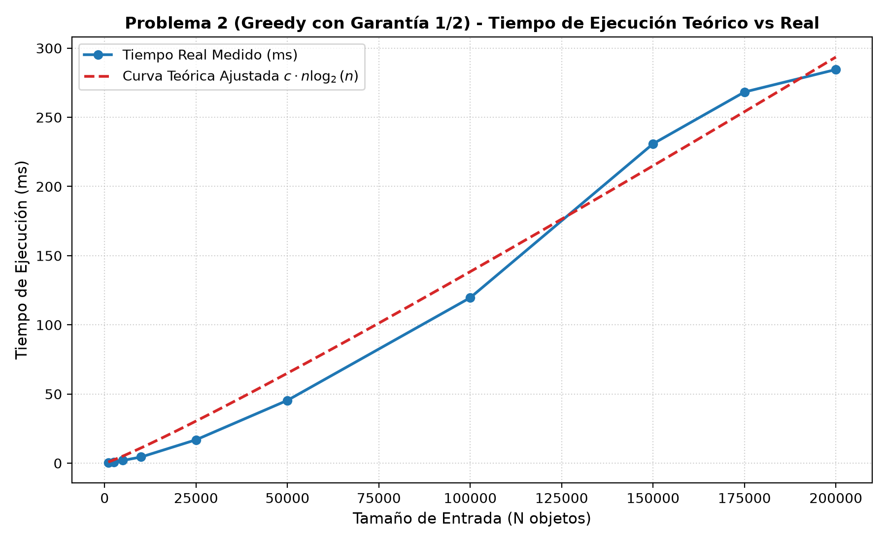

<div align="center">


# UNIVERSIDAD DE BUENOS AIRES
### FACULTAD DE INGENIERÍA
**Departamento de Computación**  
**Materia:** Teoría de Algoritmos (Código: TB024 / 75.29 / 95.06)  
**Cátedra:** Lic. Pablo Echevarría  
**Cuatrimestre:** 2° Cuatrimestre de 2026  

---

# TRABAJO PRÁCTICO 1
## El Problema de la Mochila

---

### Integrantes del Grupo

| # | Apellido y Nombre | Padrón |
| :-: | :--- | :-: |
| **1** | **Avila Solano, Nelson Brian** | **100244** |
| **2** | **González Hidalgo, Eduardo Eliezer** | **110006** |
| **3** | *[Apellido y Nombre]* | *[Padrón]* |
| **4** | *[Apellido y Nombre]* | *[Padrón]* |

**Fecha de Entrega:** Septiembre de 2026  

</div>

<div style="page-break-after: always;"></div>

---

## Índice General

1. [Introducción al Problema de la Mochila](#1-introducción-al-problema-de-la-mochila)
2. [Fuerza Bruta vs. Backtracking](#2-fuerza-bruta-vs-backtracking)
   - 2.1 Fuerza Bruta *(Pendiente)*
   - 2.2 Backtracking *(Pendiente)*
   - 2.3 Comparativa FB vs. BT *(Pendiente)*
3. [Algoritmo Greedy](#3-algoritmo-greedy)
   - 3.1 Supuestos
   - 3.2 Diseño
     - 3.2.1 Estructuras de Datos Utilizadas
     - 3.2.2 Pseudocódigo
     - 3.2.3 Garantía de Calidad (1/2) y Demostración Matemática
   - 3.3 Seguimiento con Set Reducido (Activación de la Garantía de Calidad)
   - 3.4 Complejidad Temporal
   - 3.5 Tiempos de Ejecución
   - 3.6 Informe de Resultados
4. [Programación Dinámica](#4-programación-dinámica)
   - 4.1 Planteo Tradicional: Maximizar Beneficio para Capacidad Fija *(Pendiente)*
   - 4.2 Planteo Alternativo: Minimizar Peso para Beneficio Fijo *(Pendiente)*
   - 4.3 Comparación entre ambos Planteos de PD *(Pendiente)*
5. [Programación Lineal Entera](#5-programación-lineal-entera)
   - 5.1 Modelado Matemático y Formulación en PuLP *(Pendiente)*
   - 5.2 Análisis de Complejidad y Tiempos de Ejecución *(Pendiente)*
6. [Conclusión General](#6-conclusión-general)

<div style="page-break-after: always;"></div>

---

## 1. Introducción al Problema de la Mochila

El **Problema de la Mochila 0/1** (*0/1 Knapsack Problem*) es un problema canónico de optimización combinatoria.

### Formulación Matemática
Se cuenta con:
* Una capacidad máxima de carga $W \in \mathbb{Z}^+$.
* Un conjunto de $n$ objetos disponibles $S = \{1, 2, \dots, n\}$.
* Cada objeto $i \in S$ tiene asignado un peso $w_i \in \mathbb{Z}^+$ y un beneficio o valor $v_i \in \mathbb{Z}^+$.

El objetivo es determinar la asignación binaria $x_i \in \{0, 1\}$ para cada objeto $i$, maximizando el valor total obtenido sin violar la restricción de capacidad:

$$\max \sum_{i=1}^n v_i x_i \quad \text{sujeto a} \quad \sum_{i=1}^n w_i x_i \le W, \quad x_i \in \{0, 1\}$$

Dado que existen $2^n$ subconjuntos posibles, la versión 0/1 es **NP-Hard**. En este informe se abordan diferentes técnicas algorítmicas para su resolución, analizando sus compromisos entre tiempo de cómputo y calidad de solución.

<div style="page-break-after: always;"></div>

---

## 2. Fuerza Bruta vs. Backtracking

> *Esta sección se completará en la etapa correspondiente a la resolución del Problema 1.*

### 2.1 Fuerza Bruta
* **Supuestos:** *(A completar)*
* **Diseño:**
  * *Estructuras de datos utilizadas:* *(A completar)*
  * *Pseudocódigo:* *(A completar)*
* **Seguimiento:** *(A completar con set reducido)*
* **Complejidad:** $\mathcal{O}(2^n)$
* **Sets de datos:** *(A completar)*
* **Tiempos de Ejecución:** *(A completar)*
* **Informe de Resultados:** *(A completar)*

### 2.2 Backtracking
* **Supuestos:** *(A completar)*
* **Diseño:**
  * *Estructuras de datos utilizadas:* *(A completar)*
  * *Pseudocódigo:* *(A completar)*
* **Seguimiento:** *(A completar con set reducido)*
* **Complejidad:** *(A completar)*
* **Sets de datos:** *(A completar)*
* **Tiempos de Ejecución:** *(A completar)*
* **Informe de Resultados:** *(A completar)*

### 2.3 Comparativa FB vs. BT
* **Tabla de Tiempos y Gráfico Comparativo:** *(A completar)*
* **Análisis de Resultados:** *(A completar)*

<div style="page-break-after: always;"></div>

---

## 3. Algoritmo Greedy

### 3.1 Supuestos
1. **Indivisibilidad (0/1):** Cada elemento $i$ se toma completo o se descarta ($x_i \in \{0, 1\}$); no se permite fraccionamiento.
2. **Positividad:** Capacidad $W \in \mathbb{Z}^+$, pesos $w_i \in \mathbb{Z}^+$ y valores $v_i \in \mathbb{Z}^+$ son enteros estrictamente positivos.
3. **Viabilidad:** Todo elemento con peso $w_i > W$ es descartado en el preprocesamiento por ser infactible.
4. **Garantía de calidad (factor 2):** Como la heurística voraz simple por densidad ($v_i/w_i$) puede resultar arbitrariamente mala en la mochila 0/1, el algoritmo evalúa también el elemento crítico para garantizar formalmente que la solución devuelta nunca sea inferior a la mitad del óptimo global:
   $$\text{Solución} \ge \frac{1}{2} \cdot OPT$$

---

### 3.2 Diseño

#### 3.2.1 Estructuras de Datos Utilizadas
* **`Elemento`:** Almacena `id`, `peso` ($w_i$), `valor` ($v_i$) y calcula dinámicamente `ratio = valor / peso`.
* **`ResultadoMochila`:** Encapsula `valor_total`, `peso_total`, `elementos_seleccionados` y la bandera booleana `actuo_garantia`.
* **Lista dinámica:** Arreglo contiguo para almacenar los candidatos y ordenarlos eficientemente en $\mathcal{O}(n \log n)$.

#### 3.2.2 Pseudocódigo

```text
Algoritmo MochilaGreedyConGarantia(W, Elementos):
    Candidatos <- [e en Elementos tal que e.peso <= W]
    Si Candidatos es vacio: Retornar ResultadoMochila(0, 0, [], Falso)

    Ordenar Candidatos descendentemente por (e.valor / e.peso)

    SolucionVoraz <- []; PesoVoraz <- 0; ValorVoraz <- 0; ElementoCritico <- Nulo

    Para cada e en Candidatos:
        Si PesoVoraz + e.peso <= W:
            SolucionVoraz.Agregar(e)
            PesoVoraz += e.peso
            ValorVoraz += e.valor
        Sino si ElementoCritico es Nulo:
            ElementoCritico <- e

    Si ElementoCritico != Nulo y ElementoCritico.valor > ValorVoraz:
        Retornar ResultadoMochila(ElementoCritico.valor, ElementoCritico.peso, [ElementoCritico], Verdadero)

    Retornar ResultadoMochila(ValorVoraz, PesoVoraz, SolucionVoraz, Falso)
```

#### 3.2.3 Garantía de Calidad (1/2) y Demostración Matemática
1. Sea $OPT$ el valor de la solución óptima entera 0/1 y $OPT_{\text{frac}}$ la relajación continua ($x_i \in [0, 1]$). Al ser una relajación:
   $$OPT \le OPT_{\text{frac}}$$
2. En la versión fraccionaria, Greedy es exacto: incorpora los elementos voraces $S_1$ (valor $P_1$) más una fracción continua $\alpha \in [0, 1)$ del elemento crítico $c$:
   $$OPT_{\text{frac}} = P_1 + \alpha \cdot v_c < P_1 + v_c \implies OPT < P_1 + v_c$$
3. El algoritmo selecciona $\text{Solución} = \max(P_1, v_c)$. Por propiedad del promedio:
   $$\text{Solución} = \max(P_1, v_c) \ge \frac{P_1 + v_c}{2} > \frac{OPT}{2}$$
Esto demuestra que el beneficio devuelto es estrictamente superior al 50% del óptimo global ($\text{Solución} \ge \frac{1}{2}OPT$).

---

### 3.3 Seguimiento con Set Reducido (Activación de la Garantía de Calidad)

Instancia de prueba con capacidad $W = 100$ y 7 elementos ordenados por ratio:

| ID | Peso ($w_i$) | Beneficio ($v_i$) | Ratio ($v_i / w_i$) | Decisión | Acumulados ($P_1, W_1$) |
| :-: | :-: | :-: | :-: | :---: | :---: |
| **1** | 5 | 10 | 2.00 | Entra | $P_1 = 10, W_1 = 5$ |
| **2** | 5 | 10 | 2.00 | Entra | $P_1 = 20, W_1 = 10$ |
| **3** | 10 | 18 | 1.80 | Entra | $P_1 = 38, W_1 = 20$ |
| **4** | 10 | 16 | 1.60 | Entra | $P_1 = 54, W_1 = 30$ |
| **5** | 75 | 110 | 1.47 | **Crítico** (no cabe: $30+75 > 100$) | $v_c = 110, w_c = 75$ |
| **6** | 40 | 40 | 1.00 | Entra ($30+40 \le 100$) | $P_1 = 94, W_1 = 70$ |
| **7** | 40 | 36 | 0.90 | No cabe ($70+40 > 100$) | Fin del recorrido |

* **Evaluación de garantía:** $v_c (110) > P_1 (94) \longrightarrow$ **Se activa la garantía de calidad**.
* **Resultado:** Se descarta $S_1$ y se toma únicamente `[5]`, con peso $75/100$, valor total **110** y `actuo_garantia = SÍ`.
* **Conclusión:** Sin la garantía, el voraz simple se habría conformado con $P_1 = 94$. La garantía rescató el óptimo global ($110$).

---

### 3.4 Complejidad Temporal y Espacial

* **Filtrado inicial:** Recorrido lineal comparando $w_i \le W \implies \mathcal{O}(n)$.
* **Ordenamiento:** Ordenar candidatos por ratio mediante Timsort/Mergesort $\implies \mathcal{O}(n \log n)$.
* **Recorrido voraz:** Bucle simple con sumas y comparaciones en $\mathcal{O}(1) \implies \mathcal{O}(n)$.
* **Evaluación de garantía:** Comparación y retorno en tiempo constante $\implies \mathcal{O}(1)$.

$$\mathbf{T(n) = \mathcal{O}(n) + \mathcal{O}(n \log n) + \mathcal{O}(n) + \mathcal{O}(1) = \Theta(n \log n)}$$

* **Complejidad Espacial:** $\mathbf{\mathcal{O}(n)}$, requerida para almacenar los candidatos y la solución en memoria.

---

### 3.5 Tiempos de Ejecución

Mediciones sobre los datasets generados en `datasets/` promediadas mediante repeticiones adaptativas ($5$ a $50$ corridas) con reloj de alta resolución `time.perf_counter()`. Curva de ajuste teórico por mínimos cuadrados: $t_{\text{teórico}}(n) = c \cdot n \log_2(n)$ con $c \approx 8.35 \times 10^{-8}\text{ s}$:

| $N$ (Objetos) | Capacidad ($W$) | Tiempo Real (ms) | Tiempo Teórico (ms) | Diferencia Relativa |
| :---: | :---: | :---: | :---: | :---: |
| **1.000** | 50.000 | 0.3014 | 0.8307 | 63.72% |
| **2.500** | 125.000 | 0.8530 | 2.3521 | 63.74% |
| **5.000** | 250.000 | 1.9887 | 5.1210 | 61.17% |
| **10.000** | 500.000 | 4.4643 | 11.0755 | 59.69% |
| **25.000** | 1.250.000 | 16.8907 | 30.4433 | 44.52% |
| **50.000** | 2.500.000 | 45.4110 | 65.0542 | 30.20% |
| **100.000** | 5.000.000 | 119.6179 | 138.4436 | 13.60% |
| **150.000** | 7.500.000 | 230.8713 | 214.9789 | 7.39% |
| **175.000** | 8.750.000 | 268.2985 | 254.0527 | 5.61% |
| **200.000** | 10.000.000 | 284.5446 | 293.5574 | **3.07%** |

<div align="center">



*Figura 1: Tiempos de ejecución medidos experimentalmente (azul) vs. curva teórica ajustada $c \cdot n \log_2(n)$ (rojo).*

</div>

---

### 3.6 Informe de Resultados

* **Correspondencia con la complejidad teórica:** Los resultados empíricos validan la complejidad $\mathcal{O}(n \log n)$. A medida que $N$ crece hacia el orden asintótico ($N \ge 100.000$), la diferencia relativa desciende drásticamente del $13.60\%$ al **$3.07\%$** en $N = 200.000$ ($284.54\text{ ms}$ reales vs. $293.56\text{ ms}$ teóricos), confirmando que el ordenamiento domina la ejecución.
* **Comportamiento en rangos bajos ($N \le 10.000$):** Los tiempos son del orden de microsegundos ($0.30$ a $4.46\text{ ms}$). Los desvíos relativos mayores se deben a costos fijos del entorno de ejecución (llamadas en Python, asignación de memoria) que introducen una cota constante despreciable en términos absolutos (< $6\text{ ms}$).
* **Escalabilidad:** Resolver una instancia masiva de $200.000$ objetos y capacidad $W = 10.000.000$ tomó apenas **~285 ms**, evidenciando la ventaja de Greedy frente a los algoritmos exactos para problemas a gran escala.

<div style="page-break-after: always;"></div>

---

## 4. Programación Dinámica

> *Esta sección se completará en la etapa correspondiente a la resolución del Problema 3.*

### 4.1 Planteo Tradicional: Maximizar Beneficio para Capacidad Fija
* **Supuestos:** *(A completar)*
* **Diseño:**
  * *Estructuras de datos utilizadas:* *(A completar)*
  * *Definición de Subproblemas y Relación de Recurrencia:* *(A completar)*
  * *Pseudocódigo:* *(A completar)*
* **Seguimiento con Set Reducido:** *(A completar)*
* **Complejidad:** $\mathcal{O}(n \cdot W)$ *(pseudo-polinomial)*
* **Sets de datos:** *(A completar)*
* **Tiempos de Ejecución:** *(A completar)*
* **Informe de Resultados:** *(A completar)*

### 4.2 Planteo Alternativo: Minimizar Peso para Beneficio Fijo
* **Supuestos:** *(A completar)*
* **Diseño:**
  * *Estructuras de datos utilizadas:* *(A completar)*
  * *Definición de Subproblemas y Relación de Recurrencia:* *(A completar)*
  * *Pseudocódigo:* *(A completar)*
* **Seguimiento con Set Reducido:** *(A completar)*
* **Complejidad:** $\mathcal{O}(n \cdot V)$ *(pseudo-polinomial)*
* **Sets de datos:** *(A completar)*
* **Tiempos de Ejecución:** *(A completar)*
* **Informe de Resultados:** *(A completar)*

### 4.3 Comparación entre ambos Planteos de PD
* **Tabla de Tiempos y Gráfico Comparativo:** *(A completar)*
* **Análisis de Rendimiento según $W$ vs $V$:** *(A completar)*

<div style="page-break-after: always;"></div>

---

## 5. Programación Lineal Entera

### 5.1 Modelado Matemático y Formulación en PuLP
Para el diseño, implementación y análisis del algoritmo de programación lineal entera, se establecen los siguientes supuestos, condiciones y limitaciones: 

- **Indivisibilidad de objetos (0/1):** cada elemento debe incluirse o descartarse. No se permite el fraccionamiento, convirtiendo el problema en un Programa Lineal entero Binario. 

- **Positividad de parámetros:** a Capacidad W, los pesos $$w_i$$ y los beneficios $$v_i$$ con enteros estrictamente positivos. 

- **Solver utilizado:** se emplea la biblioteca PuLP con el solver de Branch and Bound. El solver es COIN-OR Branch and cut (incluido por defecto).

- **Dependencia del solver externo:** el tiempo de ejecución abarca la resolucion interna, no incluye el tiempo de armado del modelo en PuLP


### 5.2 Diseño
 
#### 5.2.1 Modelado Matemático
 
**Variables de decisión:**
$$x_i \in \{0, 1\}, \quad i = 1, \dots, n$$
donde $x_i = 1$ indica que el elemento $i$ es incluido en la mochila, y $x_i = 0$ que no lo es.
 
**Función objetivo:**
$$\text{Maximizar} \quad Z = \sum_{i=1}^{n} v_i \cdot x_i$$
 
**Restricción de capacidad:** se quiere poder agregar todos los elementos posibles en la mochila tal que se obtenga la máxima ganancia, sin superar la capacidad.
$$\sum_{i=1}^{n} w_i \cdot x_i \leq W$$
 
**Restricción de integralidad:** esto permite definir las variables como variables enteras binarias. 
$$x_i \in \{0, 1\}, \quad \forall\, i = 1, \dots, n$$


#### 5.2.3 Pseudocódigo
 
```text
Algoritmo MochilaProgramacionLineal(valores, pesos, W):
    n = longitud(valores)
    modelo = NuevoProblema(tipo=MAXIMIZAR)
 
    Para i desde 0 hasta n-1:
        X[i] = NuevaVariableBinaria("X_i")
 
    AgregarObjetivo(modelo, sumatoria(valores[i] * X[i] para i en 0..n-1))
    AgregarRestriccion(modelo, sumatoria(pesos[i] * X[i] para i en 0..n-1) <= W)
 
    Resolver(modelo, solver=CBC)
 
    seleccionados = []
    Para i desde 0 hasta n-1:
        Si valor(X[i]) == 1:
            seleccionados.Agregar(i)
 
    Retornar seleccionados
```
 
---

### 5.3 Seguimiento con Set Reducido

Se tiene el siguiente archivo mochila10.txt que muestra inicialmente la capacidad de la mochila y luego los pares peso,valor separados por espacios. 

"
500
4,547
155,767
76,215
91,818
79,697
144,736
150,138
8,45
18,534
68,654
"
 
Se utiliza el conjunto de 10 elementos mencionado anteriormente con capacidad $W = 500$:
 
| Elemento $i$ | Peso $w_i$ | Valor $v_i$ | Densidad $v_i/w_i$ |
| :-----------: | :---------: | :---------: | :-----------------: |
| 1 | 4 | 547  | 136.75 |
| 2 | 155 | 767 | 4.95 |
| 3 | 76 | 215 | 2.83 |
| 4 | 91 | 818  | 8.99 |
| 5 | 79 | 697   | 8.82 |
| 6 |  144 | 736  | 5.11 |
| 7 | 150 | 138 | 0.92 |
| 8 | 8 | 45  | 5.62 |
| 9 | 18 | 534 | 29.67 |
| 10 | 68 | 654 | 9.62 |

**Formulación del problema:**
$$Z = 547X_1 + 767X_2 + 215X_3 + 818X_4 + 697X_5 + 736X_6 + 138X_7 + 45X_8 + 534X_9 + 654X_{10}$$
 
**Resolución por solver:** los elementos excluidos son el número 6 (peso 144, valor 736) y el número 7 (peso 150, valor 138). Si se incluyera el elemento 6, el peso total sería 499 + 144 = 643 > 500, por lo que no cabe. El elemento 7 tampoco cabe y además tiene el ratio más bajo de todos (0.92).

 
| Elemento $i$ | Peso $w_i$ | Valor $v_i$ | Seleccionado|
| :-----------: | :---------: | :---------: | :-----------------: |
| 1 | 4 | 547  | Si|
| 2 | 155 | 767 | Si |
| 3 | 76 | 215 | Si |
| 4 | 91 | 818  | Si |
| 5 | 79 | 697   | Si |
| 6 |  144 | 736  | No |
| 7 | 150 | 138 | No |
| 8 | 8 | 45  | Si |
| 9 | 18 | 534 | Si |
| 10 | 68 | 654 | Si |
| **Total** | **499** | **4277** | |

**¿Cómo queda la función objetivo después de ejecutar el programa?:**
$$Z = 547(1) + 767(1) + 215(1) + 818(1) + 697(1) + 736(0) + 138(0) + 45(1) + 534(1) + 654(1) = 4277$$ 

**Resultado final:** 
valor total = 4277, peso total = 499/500. La solución es óptima y factible.

---
 
### 5.4 Complejidad Temporal

En teoría, el problema de la mochila formulado como Programa Lineal Entero Binario tiene complejidad exponencial. Cada variable $X_i$ puede tomar valor 0 o 1, por lo que para $n$ variables el espacio de soluciones tiene $2^n$ combinaciones posibles. En el peor caso, el solver debería explorar cada una de ellas para garantizar la optimalidad,

Sin embargo, en la práctica el solver no necesita explorar ese árbol completo, gracias a tres mecanismos:

- **Se establece una cota superior:** antes de aplicar Branch & Bound, el solver resuelve la relajación continua del problema (permitiendo $X_i \in [0,1]$) mediante el método Simplex en $\mathcal{O}(n^3)$. Esta solución continua da una cota superior del valor óptimo entero. Muchas ramas del árbol quedan descartadas inmediatamente si su cota superior no puede superar la mejor solución entera encontrada hasta el momento.

- **Poda agresiva:** cuando en un nodo del árbol la solución LP relajada ya es entera (todas las variables toman valor 0 o 1 naturalmente), no hace falta seguir ramificando.

- **Planos de corte:** el solver agregar restricciones válidas que achican el espacio de soluciones, logrando obtener una soluciòn òptima. 

**Complejidad total:**
$$T(n) = \mathbf{\mathcal{O}(2^n)}$$


### 5.5 Tiempos de ejecución

A continuaciòn se muestran los resultados con diferentes tamaños de n = [10, 50, 100, 200, 500, 1000, 2000, 5000]


| n | Capacidad W | Tiempo (s) |
| :-----------: | :---------: | :---------: | 
| 10 | 500 | 0.016668  | 
| 50 | 2500 | 0.030475 |
| 100 | 5000 | 0.024867 | 
| 200 | 10000 | 0.072371  | 
| 500 | 25000 | 0.115021    | 
| 1000 |  50000 | 0.196945 | 
| 2000 | 100000 | 0.221469  | 
| 5000 | 250000 | 0.38281  | 

Se podría crear un conjunto de datasets con una mayor cantidad de elementos, pero el programa tarda demasiado. 

#### Gráfico Comparativo de Tiempos (Curva Medida vs. Curva Teórica de Ajuste)

<div align="center">


*Figura 4: Tiempos de ejecución medidos experimentalmente (puntos azules) contrastados con la curva teórica de ajuste por mínimos cuadrados $\mathcal{O}(n^3)$ (línea amarilla discontinua).*

</div>

### 5.6 Informe de resultados

En cuanto a la complejidad, la teoría establece un peor caso de $\mathcal{O}(2^n)$ debido al Branch & Bound que el solver debe aplicar. Sin embargo, los tiempos medidos en la práctica revelan un crecimiento significativamente más moderado, gracias a las técnicas de poda y planos de corte que incorpora el solver. 

Sin embargo, esta ventaja práctica tiene un límite. A medida que $n$ crece, el tiempo de resolución comienza a crecer de forma más pronunciada, y para ciertas instancias  el comportamiento exponencial teórico puede manifestarse. Por este motivo, la programación lineal entera no resulta adecuada para instancias de escala masiva como las que el algoritmo Greedy resuelve ($n = 200.000$ o más), pero sí representa la herramienta más poderosa disponible cuando se requiere una solución óptima en casos de tamaño moderado.


---

## 6. Conclusión General

> *Esta sección se completará al finalizar todos los problemas para contrastar los 6 algoritmos implementados.*

### Comparativa de Complejidades Teóricas
| Algoritmo | Paradigma | Complejidad Temporal | Tipo de Solución |
| :--- | :--- | :---: | :---: |
| **Fuerza Bruta** | Búsqueda exhaustiva | $\mathcal{O}(2^n)$ | Exacta |
| **Backtracking** | Búsqueda con poda | $\mathcal{O}(2^n)$ peor caso | Exacta |
| **Greedy con Garantía 1/2** | Heurística voraz | $\mathcal{O}(n \log n)$ | Aproximación ($\ge 50\%$) |
| **PD - Planteo Tradicional** | Programación dinámica | $\mathcal{O}(n \cdot W)$ | Exacta (pseudo-polinomial) |
| **PD - Planteo Alternativo** | Programación dinámica | $\mathcal{O}(n \cdot V)$ | Exacta (pseudo-polinomial) |
| **Programación Lineal (PuLP)** | Branch and Bound | Exponencial peor caso | Exacta |

* **Comparativa Global de Tiempos y Calidad de Solución:** *(A completar con gráfico unificado de los 6 algoritmos)*
* **Conclusiones Finales:** *(A completar)*


