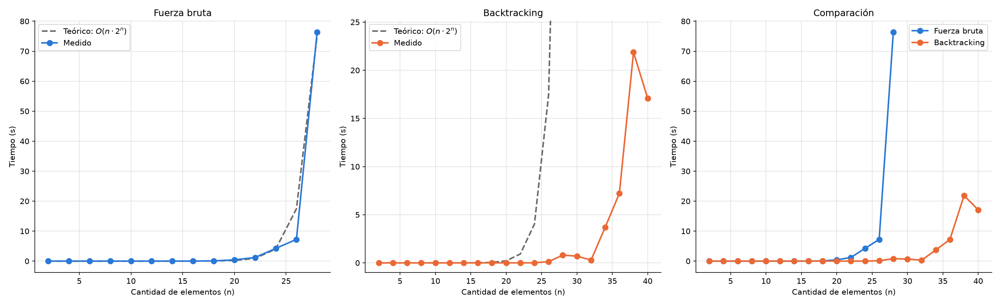

# Problema 1 – Fuerza bruta vs. Backtracking

Problema de la mochila 0/1: dado un conjunto de `n` elementos, cada uno con un peso y un valor, y una mochila de capacidad `W`, elegir un subconjunto de elementos cuyo peso total no supere `W` y cuyo valor total sea máximo.

Se implementaron dos algoritmos en Python ([codigo.py](codigo.py)):

- `fuerzaBruta`: recorre todos los subconjuntos factibles y se queda con el de mayor valor.
- `backtracking`: recorre el mismo árbol de búsqueda, pero poda las ramas que no pueden superar a la mejor solución encontrada hasta el momento.

---

## 1. Supuestos: identificar supuestos, condiciones, limitaciones y/o premisas bajo los cuales funcionará el algoritmo desarrollado

- **Mochila 0/1:** cada elemento se toma entero o no se toma. No se permiten fracciones ni elementos repetidos.
- **Datos enteros y positivos:** la capacidad de la mochila, los pesos y los valores son números enteros mayores que cero. Con valores negativos o nulos, la cota superior del backtracking dejaría de ser válida.
- **Formato de entrada:** los datos se leen de un archivo de texto con el formato generado por `crear_mochila.py`: la primera línea es la capacidad y cada línea siguiente es un par `peso,valor`.
- **Elementos independientes:** el valor total es la suma de los valores de los elementos elegidos y no hay restricciones entre elementos (incompatibilidades, dependencias, etc.).
- **Un solo óptimo informado:** si hay varias soluciones con el mismo valor máximo, se devuelve la primera encontrada según el orden de los elementos en el archivo.
- **Tamaño de entrada limitado:** los dos algoritmos son exponenciales en el peor caso, así que solo son prácticos para `n` chico. En la máquina de prueba, la fuerza bruta tarda ~76 s con `n = 28`. El backtracking llega a `n = 40` en ~17 s, pero su tiempo depende mucho de los datos: con `n = 42` una instancia superó los 9 minutos.
- **Profundidad de recursión:** la profundidad máxima es `n + 1`, muy por debajo del límite de recursión por defecto de Python (1000) para los tamaños usados.
- **Orden de los elementos:** ninguno de los dos algoritmos ordena los elementos. El backtracking poda más o menos según el orden en que aparecen, pero el resultado (el valor óptimo) no cambia.

---

## 2. Diseño

### a. Incluir un Pseudocódigo

**Fuerza bruta**

```
función fuerzaBruta(mochila, elementos, mejor):
    si mochila.valor > mejor.valor:
        mejor ← copia(mochila)

    pendientes ← copia(elementos)
    para cada elemento en elementos:
        pivote ← quitarPrimero(pendientes)          // los que quedan son los posteriores al pivote
        si pivote.peso ≤ mochila.pesoDisponible:
            agregar(mochila, pivote)
            resultado ← fuerzaBruta(copia(mochila), copia(pendientes), mejor)
            si resultado.valor > mejor.valor:
                mejor ← resultado
            quitarÚltimo(mochila)                   // deshace la elección
    devolver mejor

// llamada inicial
mejor ← fuerzaBruta(Mochila(W), elementos, Mochila(W))
```

**Backtracking**

```
función cotaSuperior(mochila, elementos):
    cota ← mochila.valor
    para cada elemento en elementos:
        si elemento.peso ≤ mochila.pesoDisponible:
            cota ← cota + elemento.valor
    devolver cota

función backtracking(mochila, elementos, mejor):
    si mochila.valor > mejor.valor:
        mejor ← copia(mochila)

    si cotaSuperior(mochila, elementos) ≤ mejor.valor:   // poda de la rama
        devolver mejor

    pendientes ← copia(elementos)
    para cada elemento en elementos:
        pivote ← quitarPrimero(pendientes)
        si pivote.peso ≤ mochila.pesoDisponible:
            agregar(mochila, pivote)
            resultado ← backtracking(mochila, pendientes, mejor)
            si resultado.valor > mejor.valor:
                mejor ← resultado
            quitarÚltimo(mochila)
            si cotaSuperior(mochila, pendientes) ≤ mejor.valor:   // poda del resto de los hermanos
                cortar el ciclo
    devolver mejor
```

La cota superior es la cantidad más optimista que se puede alcanzar desde el estado actual: el valor que ya hay en la mochila más el valor de cada elemento restante que entraría por sí solo en el espacio libre. Ningún subconjunto factible de los elementos restantes puede superarla, así que si no supera al mejor valor ya encontrado, la rama puede descartarse sin perder el óptimo.

La segunda poda (después de deshacer la elección del pivote) vale para todos los hermanos que quedan en el ciclo, porque todos son subconjuntos de `pendientes`.

### b. Detallar las estructuras de datos utilizadas

| Estructura | Implementación | Uso |
|---|---|---|
| `Elemento` | Clase con dos enteros: `peso` y `valor`. | Representa cada elemento del archivo. |
| `Mochila` | Clase con `peso` (capacidad), `pesoDisponible`, `valorActual` e `itemsDentro` (lista de Python). | Estado parcial de la solución. `itemsDentro` funciona como **pila**: `agregarElemento` hace `append` y `quitarElemento` hace `pop`, ambos O(1). `pesoDisponible` y `valorActual` se actualizan en cada operación para no recalcularlos. `copiar()` cuesta O(n). |
| Lista de elementos | `list` de Python con objetos `Elemento`. | Elementos a considerar. Se copia (`list(...)`) y se consume con `pop(0)` para que cada pivote solo combine con los elementos posteriores, y así cada subconjunto se genere una sola vez. |
| Mejor solución | Una `Mochila` copiada. | Guarda la mejor solución encontrada y se pasa por parámetro en la recursión. |
| Pila de llamadas | Recursión. | Representa el camino actual en el árbol de decisión. Profundidad máxima `n + 1`. |

La diferencia entre los dos algoritmos en el manejo de memoria: la fuerza bruta pasa una **copia** de la mochila y de la lista a cada llamada recursiva, mientras que el backtracking trabaja sobre **la misma mochila**: agrega, llama y deshace. Solo la copia cuando encuentra una mejor solución.

---

## 3. Seguimiento: Ejemplo de seguimiento con un set de datos reducido

Se usa [Mochilas/mochila5.txt](Mochilas/mochila5.txt), con capacidad **W = 250** y 5 elementos:

| Elemento | Peso | Valor |
|---|---|---|
| A | 74 | 140 |
| B | 171 | 65 |
| C | 127 | 470 |
| D | 27 | 303 |
| E | 196 | 410 |

### Fuerza bruta

Cada línea es una llamada recursiva (un nodo del árbol). La sangría indica la profundidad.

```
{}        peso=0   valor=0   restantes=[A,B,C,D,E]
  {A}     peso=74  valor=140 restantes=[B,C,D,E]  -> NUEVO MEJOR (140)
    {A,B} peso=245 valor=205 restantes=[C,D,E]    -> NUEVO MEJOR (205)
          C, D, E no entran (disponible = 5)
    {A,C} peso=201 valor=610 restantes=[D,E]      -> NUEVO MEJOR (610)
      {A,C,D} peso=228 valor=913 restantes=[E]    -> NUEVO MEJOR (913)
          E no entra (disponible = 22)
          E no entra (disponible = 49)
    {A,D} peso=101 valor=443 restantes=[E]
          E no entra (disponible = 149)
          E no entra (disponible = 176)
  {B}     peso=171 valor=65  restantes=[C,D,E]
          C no entra (disponible = 79)
    {B,D} peso=198 valor=368 restantes=[E]
          E no entra (disponible = 52)
          E no entra (disponible = 79)
  {C}     peso=127 valor=470 restantes=[D,E]
    {C,D} peso=154 valor=773 restantes=[E]
          E no entra (disponible = 96)
          E no entra (disponible = 123)
  {D}     peso=27  valor=303 restantes=[E]
    {D,E} peso=223 valor=713 restantes=[]
  {E}     peso=196 valor=410 restantes=[]
```

Recorre los **13 subconjuntos factibles** (de los 2⁵ = 32 posibles) y devuelve **{A, C, D}**, con peso 228 y valor **913**.

### Backtracking

Se agrega la cota superior de cada nodo y las podas.

```
{}        valor=0   restantes=[A,B,C,D,E]  cota=1388
  {A}     valor=140 restantes=[B,C,D,E]    cota=978  -> NUEVO MEJOR (140)
    {A,B} valor=205 restantes=[C,D,E]      cota=205  -> NUEVO MEJOR (205)
                                                     PODA: cota 205 ≤ mejor 205
    {A,C} valor=610 restantes=[D,E]        cota=913  -> NUEVO MEJOR (610)
      {A,C,D} valor=913 restantes=[E]      cota=913  -> NUEVO MEJOR (913)
                                                     PODA: cota 913 ≤ mejor 913
      corte del ciclo: sin D, cota con [E] = 610 ≤ 913       (no visita {A,C,E})
    corte del ciclo: sin C, cota con [D,E] = 443 ≤ 913       (no visita {A,D})
  {B}     valor=65  restantes=[C,D,E]      cota=368  PODA: 368 ≤ 913
  {C}     valor=470 restantes=[D,E]        cota=773  PODA: 773 ≤ 913
  corte del ciclo: sin C, cota con [D,E] = 713 ≤ 913         (no visita {D}, {E})
```

Llega al mismo resultado, **{A, C, D} con valor 913**, visitando **7 nodos en vez de 13**. Una vez encontrado el óptimo (913), las cotas de las ramas restantes ({B}: 368, {C}: 773, {D, E}: 713) no lo pueden superar y se descartan sin explorarlas.

---

## 4. Complejidad: Análisis de la complejidad temporal a partir del pseudocódigo

### Fuerza bruta

**Cantidad de nodos.** Cada llamada recursiva corresponde a un subconjunto factible distinto, porque el pivote solo se combina con los elementos que vienen después de él. Así, cada subconjunto se genera una sola vez, en orden creciente de índices. Hay a lo sumo **2ⁿ** subconjuntos. El peor caso es cuando todos los elementos entran juntos (`W ≥ Σ pesos`) y el árbol tiene exactamente 2ⁿ nodos.

**Costo por nodo.**

- Comparar con el mejor: O(1). Copiar la mochila cuando mejora: O(n).
- Por cada hijo que se crea: `agregarElemento` y `quitarElemento` en O(1), `copia(mochila)` en O(n) y `copia(pendientes)` en O(n). Ese costo se le asigna al hijo, así que cada nodo carga con O(n).
- El ciclo con `quitarPrimero` (`pop(0)`) cuesta O(k²) en un nodo con `k` elementos restantes. Pero hay 2ⁿ⁻¹⁻ᵏ nodos con `k` restantes, y Σₖ 2ⁿ⁻¹⁻ᵏ · k² = 2ⁿ⁻¹ · Σₖ k²/2ᵏ = O(2ⁿ). Ese término queda absorbido.

**Recurrencia.** Llamando `T(k)` al costo de resolver con `k` elementos restantes, con `n` fijo:

```
T(0) = c·n
T(k) = 2·T(k−1) + c·n        (incluir o no el primer elemento disponible, más O(n) de copias)
     ⇒ T(n) = c·n·(2ⁿ⁺¹ − 1)
```

**T<sub>FB</sub>(n) = O(n · 2ⁿ)**

**Memoria:** O(n²), porque cada uno de los hasta `n` niveles de la recursión guarda una copia de la mochila y de la lista.

### Backtracking

El árbol de búsqueda es el mismo. Los cambios son:

- Ya no hay copias por hijo: agregar y deshacer cuestan O(1). La mochila solo se copia cuando mejora el óptimo, O(n).
- Se agrega `cotaSuperior`, que recorre los elementos restantes: O(n) al entrar al nodo y O(n) después de cada hijo, costo que se le asigna al hijo.

Entonces cada nodo sigue costando O(n). **En el peor caso la poda no descarta ninguna rama** (por ejemplo, si cada nueva solución mejora apenas la anterior y la cota nunca baja del óptimo actual), se visitan los 2ⁿ nodos y queda la misma recurrencia:

**T<sub>BT</sub>(n) = O(n · 2ⁿ)**

La poda **no mejora el orden del peor caso**, pero en la práctica reduce muchísimo la cantidad de nodos visitados. En el seguimiento pasó de 13 a 7 nodos, y en las mediciones de la sección 6 se ve que el ahorro crece con `n`. **Memoria:** O(n), por la profundidad de recursión más una copia de la mejor solución.

---

## 5. Sets de datos: Adjuntar los sets de datos utilizados. Indicar los criterios con que se tomaron

**Generación.** Los sets los genera [grafico.py](grafico.py) (función `crearElementos`) con la **misma distribución que `crear_mochila.py`**:

- Peso de cada elemento: entero uniforme entre 1 y 200.
- Valor de cada elemento: entero uniforme entre 1 y 1000.
- Capacidad de la mochila: `W = 50·n`. Como el peso medio es ~100, entra aproximadamente la mitad de los elementos.

Cada set se genera con una **semilla fija**, `random.Random(semilla)`, así que cualquier corrida los reproduce exactamente.

**Tamaños elegidos.** Se usan tamaños pares, buscando que se vea el crecimiento exponencial sin que la corrida total supere unos 10 minutos:

| Algoritmo | Tamaños (`n`) | Motivo del límite |
|---|---|---|
| Fuerza bruta | 2, 4, …, 28 | Con `n = 28` tarda ~76 s por corrida. Con `n = 30` se estiman ~5 min por corrida. |
| Backtracking | 2, 4, …, 40 | Con `n = 42` una instancia superó los 9 minutos sin terminar. |

Para `n ≤ 28` los dos algoritmos usan **exactamente los mismos sets**, así la comparación es directa.

**Semillas.**

- Por defecto, la semilla de cada tamaño es `42 + n`.
- Para `n ≥ 30` (solo backtracking), el tiempo variaba muchísimo entre instancias del mismo tamaño: por ejemplo, con `n = 34` fue de 0,27 s a 56 s. Para que cada tamaño quede representado por una instancia típica, se generaron **7 instancias por tamaño** (semillas `42 + n + 1000·k`, con `k = 0…6`) y se eligió **la de tiempo mediano**. Las semillas elegidas quedaron en `SEMILLAS_ELEGIDAS` de `grafico.py`: `n = 32 → 3074`, `n = 34 → 1076`, `n = 36 → 3078`, `n = 38 → 5080`. Para `n = 30` y `n = 40`, la mediana coincidió con la semilla por defecto.

**Seguimiento.** Para el ejemplo de la sección 3 se usó [Mochilas/mochila5.txt](Mochilas/mochila5.txt), generado con `crear_mochila.py`.

---

## 6. Tiempos de Ejecución: medir los tiempos de ejecución de cada set de datos y presentarlos en un gráfico

**Metodología.**

- **Medición:** `time.perf_counter()` alrededor de la llamada a cada algoritmo.
- **Repeticiones:** cada set se ejecuta 3 veces y se toma el **mínimo**, para descartar interrupciones del sistema operativo.
- **Entorno:** Intel Core i5-14600KF, Windows 11, Python 3.14.6.
- **Curva teórica:** cantidad de operaciones del orden calculado (`n·2ⁿ`) multiplicada por un tiempo asumido por operación elemental de **10 ns**: `t_teórico(n) = n · 2ⁿ · 10⁻⁸ s`. Se usa la misma curva para los dos algoritmos, porque los dos tienen el mismo orden en el peor caso.

Los resultados completos están en `tiempos.csv`.

| n | Teórico n·2ⁿ·10⁻⁸ (s) | Fuerza bruta (s) | Backtracking (s) | FB / BT | BT / teórico |
|---:|---:|---:|---:|---:|---:|
| 2 | 0,00000008 | 0,0000007 | 0,0000006 | 1 | — |
| 4 | 0,0000006 | 0,0000075 | 0,0000045 | 2 | — |
| 6 | 0,0000038 | 0,0000136 | 0,0000075 | 2 | — |
| 8 | 0,0000205 | 0,0000648 | 0,0000165 | 4 | 80,6 % |
| 10 | 0,000102 | 0,000335 | 0,0000466 | 7 | 45,5 % |
| 12 | 0,000492 | 0,000969 | 0,000124 | 8 | 25,3 % |
| 14 | 0,002294 | 0,003701 | 0,000214 | 17 | 9,35 % |
| 16 | 0,010486 | 0,018880 | 0,000399 | 47 | 3,80 % |
| 18 | 0,047186 | 0,081652 | 0,000922 | 89 | 1,95 % |
| 20 | 0,209715 | 0,421127 | 0,002179 | 193 | 1,04 % |
| 22 | 0,922747 | 1,198938 | 0,003618 | 331 | 0,39 % |
| 24 | 4,026532 | 4,248935 | 0,003272 | 1299 | 0,081 % |
| 26 | 17,448305 | 7,237426 | 0,131278 | 55 | 0,75 % |
| 28 | 75,161928 | 76,358396 | 0,805558 | 95 | 1,07 % |
| 30 | 322,12 | — | 0,699305 | — | 0,22 % |
| 32 | 1 374,39 | — | 0,289191 | — | 0,021 % |
| 34 | 5 841,16 | — | 3,703661 | — | 0,063 % |
| 36 | 24 739,01 | — | 7,211016 | — | 0,029 % |
| 38 | 104 453,60 | — | 21,866105 | — | 0,021 % |
| 40 | 439 804,65 | — | 17,087767 | — | 0,0039 % |

Para `n ≤ 6` la columna BT / teórico no se informa: los tiempos son de microsegundos, dominados por el costo fijo de las llamadas de Python, y el cociente no es representativo.



- **Izquierda:** fuerza bruta, tiempo medido contra la curva teórica `O(n·2ⁿ)`.
- **Centro:** backtracking, tiempo medido contra la misma curva teórica. El eje Y se limita al rango de los tiempos medidos para que se vea su evolución; la curva teórica sale del gráfico alrededor de `n = 26`.
- **Derecha:** comparación de los tiempos medidos de los dos algoritmos, en la misma escala.

---

## 7. Informe de Resultados: redactar un informe de resultados comparando los tiempos de ejecución. ¿Se corresponde con la complejidad determinada inicialmente? El gráfico comparativo de tiempos debe incluir tanto la curva con los valores medidos como la curva teórica de ajuste

**Correctitud.** Los dos algoritmos devuelven el mismo valor óptimo en todos los sets en que se pudo comparar (n = 2 a 22 se verificó explícitamente, además del seguimiento con `mochila5.txt`). El backtracking llega al mismo resultado que la fuerza bruta en menos tiempo, como pide el enunciado.

**Fuerza bruta: sí se corresponde con O(n·2ⁿ).**

- La curva medida sigue a la teórica muy de cerca: 4,25 s contra 4,03 s en `n = 24`, y 76,4 s contra 75,2 s en `n = 28`. Esto confirma, además, que 10 ns por operación es una buena estimación para esta máquina.
- Cada dos elementos más, el tiempo se multiplica por un factor cercano a 4, como predice `2ⁿ`. Por ejemplo, de `n = 16` a `n = 18` pasa de 0,019 s a 0,082 s (×4,3) y de `n = 18` a `n = 20`, de 0,082 s a 0,42 s (×5,2).
- La desviación más visible es `n = 26` (7,2 s, por debajo de los 17,4 s teóricos). La fuerza bruta no recorre los 2ⁿ subconjuntos, sino solo los **factibles**, y su cantidad depende de los pesos concretos de cada set. La curva teórica corresponde al peor caso (todos los elementos entran), así que funciona como cota superior del comportamiento real, con oscilaciones según los datos.

**Backtracking: cumple la cota O(n·2ⁿ), pero en la práctica queda muy por debajo.**

- El tiempo medido es una fracción cada vez menor de la curva teórica: ~45 % en `n = 10`, ~1 % en `n = 20` y 0,004 % en `n = 40`. Para `n = 40` el modelo teórico predice unos 5 días (439 805 s) y el backtracking terminó en 17 s.
- Esto no contradice el análisis de complejidad. `O(n·2ⁿ)` es el **peor caso**, en el que la poda no descarta nada, y con datos aleatorios como los de `crear_mochila.py` la poda elimina la gran mayoría de las ramas. Cuanto más grande es el árbol, más nodos quedan debajo de cada rama podada, y por eso la proporción de trabajo ahorrado crece con `n`.
- El crecimiento medido sigue siendo exponencial, pero con una base efectiva mucho menor que 2. Entre `n = 20` y `n = 40` el tiempo crece unas 8 000 veces (de 0,0022 s a 17 s), mientras que `n·2ⁿ` crece unas 2 millones de veces.
- La curva no es estrictamente creciente: `n = 32` (0,29 s) tarda menos que `n = 30` (0,70 s), y `n = 40` (17,1 s) menos que `n = 38` (21,9 s). La cantidad de podas depende de los datos de cada instancia: cuándo aparece una buena solución, qué tan ajustada es la cota y el orden de los elementos. Incluso eligiendo la instancia mediana entre 7, la variabilidad entre instancias del mismo tamaño es muy alta (en `n = 34`, de 0,27 s a 56 s). El tiempo del backtracking depende más de los datos que del tamaño.

**Comparación entre los dos algoritmos.**

- Para `n ≤ 6` los dos tardan lo mismo en la práctica (microsegundos). El árbol es tan chico que la poda casi no tiene qué descartar, y cada nodo del backtracking hace más trabajo, porque calcula la cota.
- A partir de `n ≈ 10` la diferencia empieza a crecer rápido: el backtracking es ~17 veces más rápido en `n = 14`, ~190 en `n = 20` y ~95 en `n = 28`, con picos de ~1300 (`n = 24`) según la instancia.
- En la práctica, esto amplía el tamaño de problema que se puede resolver en un tiempo razonable: con unos 20 s por instancia, la fuerza bruta llega hasta `n ≈ 26` y el backtracking hasta `n ≈ 38`.

**Conclusión.** Los dos algoritmos tienen complejidad temporal `O(n·2ⁿ)` en el peor caso, y los tiempos medidos de la fuerza bruta se ajustan muy bien a esa curva. El backtracking respeta la misma cota, pero la poda por cota superior hace que su comportamiento real sea órdenes de magnitud mejor. A cambio, su tiempo es menos predecible: depende de los datos de cada instancia y no solo de `n`.
